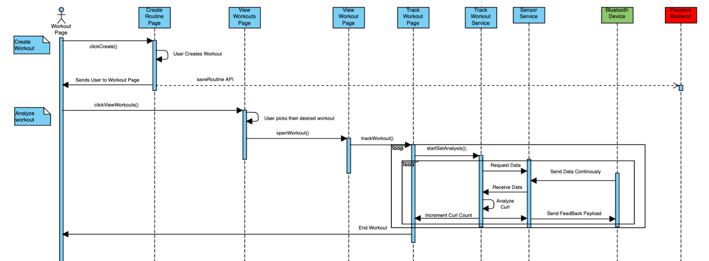

## Software

### Modules

The UI consists of pages for creating, managing, and tracking workout routines. The main page is made up of 3 tabs: Workout, History, and Settings.

#### Workout

The Workout tab is where the user creates routines and tracks workouts. In the paradigm of the app, a routine/workout contains the:

- Workout name
- A list of exercises that make up the workout

An exercise contains the:
- Exercise name
- A list of sets that make up the exercise
- Flags that indicate whether the sets share repetition, weight, and rest information

A set contains the: 
- Number of repetitions
- Weight 
- Rest duration

The Create Workout page consists of a form where the user enters information to create a routine. Upon the form initialization, a routine object is created to represent the workout. Each widget of the form corresponds to an element in the routine object according to the paradigm above. For example, modifications to an exercise widget will directly modify the values within the corresponding exercise. The form also validates the input to ensure each workout is named, contains at least one exercise, and has valid set information for each exercise. 

A user’s workout routines are saved in an unordered map for efficient retrieval. Each routine has an associated UUID to act as the key. This UUID is not visible to the user but allows multiple routines of the same name. 

The View Workouts page will display all the routines that the user has created. Upon initialization, this map is loaded and a list item generated from each entry. Clicking on one will display that routine’s information. Here, the user can edit the routine in a manner similar to the workout creation or delete the routine entirely. They can also begin tracking the workout, which will open the Track Workout page. 

When the workout is beginning to be tracked, its information is passed to the Track Workout service. This ensures that the information is both accessible throughout the app and also persists even when the Track Workout page is no longer displayed. These functionalities are required because the user will interact with the tracked workout in two ways: primarily through the Track Workout page where the complete workout progress is displayed and recorded but also through the Rest Timer widget which appears at the bottom of the Workout Page to indicate the current rest time. Multiple timer services are also running in the background to keep track of the rest duration and elapsed workout duration. 
Within the Track Workout page, the user will execute the workout. The user can either manually or automatically track each set of an exercise. In manual tracking, the user will perform the set without the analysis of the sensors and record how many successful repetitions they completed by tapping on the rep counter. 

The automatic tracking interfaces with the sensor service which provides the most up to date sensor measurements. These measurements are organized in a map, where the key is the name of the sensor node corresponding to the position on the body, and the value is the most recent measurement at that node. Each time new measurements are received, the service will update the map and broadcast an event. The track workout service contains a listener that will listen for these events and will subsequently run an iteration of the exercise analysis. By examining the change in sensor measurements from one iteration to the next, the analysis can determine whether a rep has been successfully completed, and report to the UI to reflect progress.

#### History

The History module displays the results of recorded workouts in both a List and Calendar view. Clicking on a record will enter the View Completed Workout page, where the user can view their results for that workout. While a workout object can represent a template of a routine, it can also represent a completed workout’s results. There are additional nullable fields for maintaining the start date and time and workout duration. Set objects also contain an additional reps completed value. This allows progress to be directly recorded into the same template that is loaded into a Track Workout page and saved in the same format. As a result, the UI for viewing a completed workout can be very similar and functionality can be borrowed when making edits to a completed workout. The completed workouts are themselves saved in a manner very similar to a user’s workout templates. 

#### Settings

Within the Settings module, the user can edit their profile and connect to the Smart Gym sensors. The Bluetooth settings page will display all the Smart Gym sensors in range that are connectable, as well as those that are already connected. This system makes use of the FlutterBlue plugin which takes care of many of the lower level Bluetooth system calls to enable cross platform Bluetooth functionality. Upon opening the Bluetooth settings page, the app periodically listens for newly connected and scanned Bluetooth devices. These results are filtered so that only devices with a preset device name prefix are displayed, ensuring that within the app the user can only interact with Smart Gym sensors. When a device is connected, the app begins listening to the orientation service as named in the Arduino code, and continuously retrieves the measurement data. This data is then passed to the previously mentioned sensor service and made available to the entirety of the app. 

### Software Flowchart

