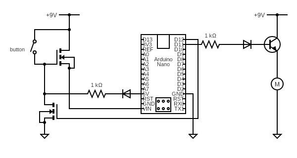

# Smart Gym Hardware

Circuit Diagram of Arduino Nano 33 BLE, and connected power control circuit and haptic motor controller.

## Power Control Circuit

The power control circuit is designed to allow the user to power on the device with a single button press. The device will then remain powered on until the arduino sends an "off" signal (High/3.3V) from pin D12. This will cut off current from the connected Voltage Source (In this case, a 9V battery), and power off the arduino. 

The circuit is comprised of two NMOS transistors, a diode, and a resistor. The purpose of the first (top) transistor is to connect the positive terminal of the battery to the Vin pin. The transistor is opened by connecting the gate 9V, allowing the voltage source to pass to Vin. Once the arduino is powered on, the 5V output will turn on, and keep the first transistor open when the button is released. The diode prevents current from flowing back into the arduino when the button and 5V pins are both active. The second transistor will be off while the arduino is active, preventing any current flow from the 5V output, except for leakage. When the software determines that the arduino is inactive and will shut down, the second transistor is opened by setting D12 to HIGH. This pulls the gate of the first transistor to 0V, which turns off the transistor, and cuts off power to the arduino. Some current will pass through the resistor via the 5V pin very briefly.

This method powers on/off the device as soon as the button is pressed / the HIGh signal is sent to the second transistor.

## Haptic Motor
The Haptic Motor is controlled by a simple BJT transitor, modulated by pin D11, connected through a resistor and a diode to the BJT's gate. This allows current to flow from the 9V source through the motor when D11 is set to HIGH. In software, D11 can be set to HIGH for brief moments to activate the vibrate function. 

(Prototype)
